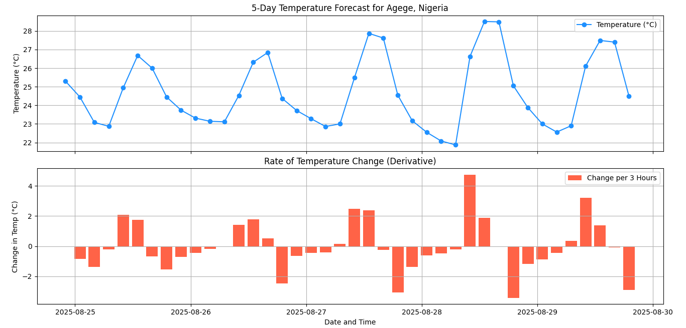

# Weather Trend Analysis 🌦️📈

This project uses the **OpenWeather API** and **Python (Pandas, Matplotlib)** to analyze  
5-day / 3-hour forecasts. It applies **derivatives, moving averages, volatility, and anomaly detection** to study temperature trends.  
## 📸 Screenshot
Here’s how it looks in action:



## Features
- Fetch real weather data (via API).
- Compute **rate of change (derivative)** of temperature.
- Add **moving averages** for smoothing.
- Detect **volatility** (rolling standard deviation).
- Flag **anomalies** when sudden spikes/drops occur.
- Save enriched CSV & plots for portfolio.

## Requirements
- Python 3.9+
- `pip install -r requirements.txt`

```bash
requests
pandas
matplotlib
python-dotenv
